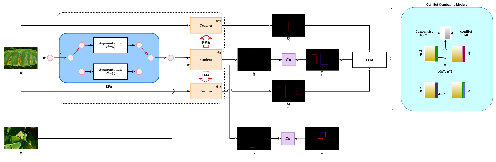

# AD-MT_Remake — AD-MT cho YOLO Detection

AD-MT_Remake áp dụng Alternate Diverse Teaching (AD-MT) cho YOLO detection trên dataset Banana.

**Tham khảo:**
- AD-MT (ECCV 2024) — code gốc: <https://github.com/ZhenZHAO/AD-MT>
- Paper: *Alternate Diverse Teaching for Semi-supervised Medical Image Segmentation* — <https://arxiv.org/abs/2311.17325>


## 1. Huấn luyện

```bash
cd AD-MT_Remake
```

### 1.1. Train bán giám sát (RPA + CCM trên YOLO)

Script `run_yolo_admt.sh` nhận tham số `GPU_ID CONFIG`:

```bash
bash run_yolo_admt.sh 0 exps/conf_025/varifocal_custom/yolov11-sa/config.yml
```

**Trước khi chạy — cấu hình cần sửa:**

Mở file config tương ứng (ví dụ `exps/conf_025/varifocal_custom/yolov11-sa/config.yml`) và sửa:
- `root_path`, `dataset_yaml`
- `model`
- `conf_threshold`, `consistency`, `ema_decay`, `alt_param_conflict_weight`
- `alt_param_updating_period_iters`, `alt_flag_updating_period_random`

## 2. Đánh giá

Sau khi train xong, trong thư mục snapshot của exp tương ứng (`exps/<conf>/<loss>/<model>/`) sẽ có:
- `best_tea_model.pt`, `best_stu_model.pt` — định dạng Ultralytics, dùng trực tiếp với `yolo val`.
- `last_ckpt.pt` — checkpoint resume.
- `log.txt`, `log/` — log và TensorBoard.

```bash
yolo val \
    data=Banana_Disease_Dataset_Test.yaml \
    model=exps/conf_025/varifocal_custom/yolov11-sa/best_tea_model.pt \
    imgsz=1024 \
    conf=0.1 \
    iou=0.1 \
    agnostic_nms=True \
    exist_ok=True
```

Chỉnh `data` và `model` theo đường dẫn của bạn.

## 3. Kết quả

Validation trên tập test (181 ảnh, 15052 instances, 2 classes). Giá trị **in đậm** = tăng so với baseline YOLOv11 cùng nhóm (cùng ngưỡng tin cậy + cùng loss).

<table>
<thead>
<tr>
<th>Ngưỡng tin cậy</th>
<th>Trọng số mất mát</th>
<th>Mô hình</th>
<th>Độ chính xác</th>
<th>Độ nhạy</th>
<th>mAP0.5</th>
<th>mAP0.5:0.95</th>
<th>F1-score</th>
</tr>
</thead>
<tbody>
<tr>
<td rowspan="9">1%</td>
<td rowspan="3">BCE</td>
<td>YOLOv11</td>
<td>59.4</td><td>51.7</td><td>54.0</td><td>24.0</td><td>55.3</td>
</tr>
<tr><td>YOLOv11-SA</td><td>57.3</td><td>50.7</td><td>50.7</td><td>22.3</td><td>53.8</td></tr>
<tr><td>YOLOv11-SA custom</td><td>58.3</td><td>51.2</td><td>52.9</td><td>23.6</td><td>54.5</td></tr>
<tr>
<td rowspan="3">Varifocal</td>
<td>YOLOv11</td>
<td>58.5</td><td>51.5</td><td>52.1</td><td>23.1</td><td>54.8</td>
</tr>
<tr><td>YOLOv11-SA</td><td>56.7</td><td>51.1</td><td>50.3</td><td>22.2</td><td>53.8</td></tr>
<tr><td>YOLOv11-SA custom</td><td>58.3</td><td>51.3</td><td><b>52.3</b></td><td><b>23.4</b></td><td>54.6</td></tr>
<tr>
<td rowspan="3">Varifocal Custom</td>
<td>YOLOv11</td>
<td>59.5</td><td>51.8</td><td>54.2</td><td>24.5</td><td>55.4</td>
</tr>
<tr><td>YOLOv11-SA</td><td>58.0</td><td>51.0</td><td>52.2</td><td>23.3</td><td>54.3</td></tr>
<tr><td>YOLOv11-SA custom</td><td>58.9</td><td>51.3</td><td>53.4</td><td>23.8</td><td>54.8</td></tr>
<tr>
<td rowspan="9">25%</td>
<td rowspan="3">BCE</td>
<td>YOLOv11</td>
<td>61.8</td><td>45.9</td><td>51.9</td><td>24.0</td><td>52.7</td>
</tr>
<tr><td>YOLOv11-SA</td><td>55.5</td><td><b>49.7</b></td><td>50.0</td><td>22.3</td><td>52.4</td></tr>
<tr><td>YOLOv11-SA custom</td><td>55.5</td><td><b>50.3</b></td><td>51.1</td><td>22.9</td><td><b>52.8</b></td></tr>
<tr>
<td rowspan="3">Varifocal</td>
<td>YOLOv11</td>
<td>56.7</td><td>50.7</td><td>52.5</td><td>23.7</td><td>53.5</td>
</tr>
<tr><td>YOLOv11-SA</td><td>55.3</td><td>49.2</td><td>49.3</td><td>22.0</td><td>52.1</td></tr>
<tr><td>YOLOv11-SA custom</td><td><b>58.5</b></td><td>48.4</td><td>50.6</td><td>23.3</td><td>53.0</td></tr>
<tr>
<td rowspan="3">Varifocal Custom</td>
<td>YOLOv11</td>
<td>62.4</td><td>47.5</td><td>53.4</td><td>24.7</td><td>53.9</td>
</tr>
<tr><td>YOLOv11-SA</td><td><b>64.0</b></td><td>44.8</td><td>52.7</td><td><b>25.1</b></td><td>52.7</td></tr>
<tr><td>YOLOv11-SA custom</td><td>55.7</td><td><b>50.7</b></td><td>50.7</td><td>23.2</td><td>53.1</td></tr>
<tr>
<td rowspan="9">dynamic</td>
<td rowspan="3">BCE</td>
<td>YOLOv11</td>
<td>56.8</td><td>48.4</td><td>51.3</td><td>23.6</td><td>52.3</td>
</tr>
<tr><td>YOLOv11-SA</td><td><b>60.7</b></td><td>44.7</td><td>50.3</td><td>23.0</td><td>51.5</td></tr>
<tr><td>YOLOv11-SA custom</td><td><b>57.7</b></td><td>45.7</td><td>48.9</td><td>22.3</td><td>51.0</td></tr>
<tr>
<td rowspan="3">Varifocal</td>
<td>YOLOv11</td>
<td>60.4</td><td>46.7</td><td>52.1</td><td>24.6</td><td>52.7</td>
</tr>
<tr><td>YOLOv11-SA</td><td><b>66.4</b></td><td>42.0</td><td><b>52.8</b></td><td><b>25.6</b></td><td>51.5</td></tr>
<tr><td>YOLOv11-SA custom</td><td>56.7</td><td>46.2</td><td>48.5</td><td>22.3</td><td>50.9</td></tr>
<tr>
<td rowspan="3">Varifocal Custom</td>
<td>YOLOv11</td>
<td>57.3</td><td>47.2</td><td>49.7</td><td>22.8</td><td>51.8</td>
</tr>
<tr><td>YOLOv11-SA</td><td><b>58.9</b></td><td>47.1</td><td><b>50.4</b></td><td><b>23.2</b></td><td><b>52.3</b></td></tr>
<tr><td>YOLOv11-SA custom</td><td><b>61.2</b></td><td><b>47.4</b></td><td><b>52.7</b></td><td><b>24.5</b></td><td><b>53.4</b></td></tr>
</tbody>
</table>
