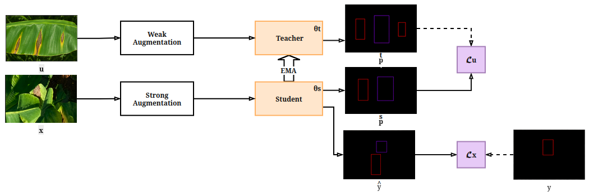
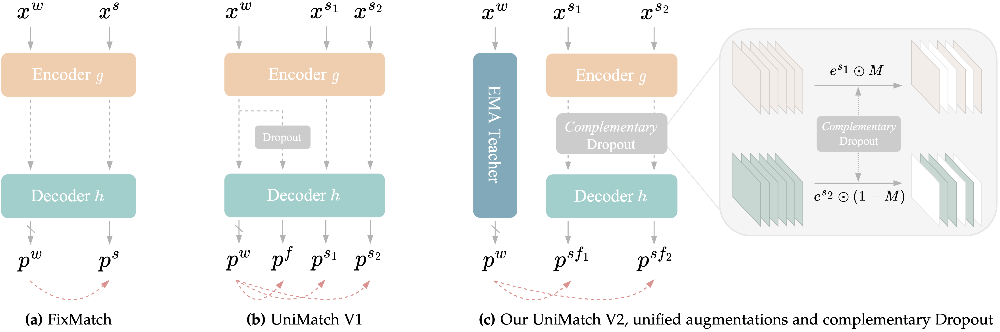

# UniMatch-V2_Remake — UniMatch V2 cho YOLO Detection

Bản remake của **UniMatch V2** áp dụng cho semi-supervised YOLO object detection trên dataset banana.

**Tham khảo:**
- UniMatch V2 (TPAMI 2025, paper): *UniMatch V2: Pushing the Limit of Semi-Supervised Semantic Segmentation* — <https://arxiv.org/abs/2410.10777>
- UniMatch V2 (code gốc): <https://github.com/LiheYoung/UniMatch-V2>
- UniMatch V1 (tiền thân): <https://github.com/LiheYoung/UniMatch>



<p align="left">

</p>

## 1. Tổng quan

Pipeline FixMatch-style với 1 student + 1 teacher EMA, mở rộng theo các đóng góp chính của UniMatch V2 áp dụng cho detection:
1. **Dual-stream weak↔strong consistency** — mỗi ảnh unlabeled sinh 2 strong view (s1, s2); pseudo-label lấy từ teacher EMA trên weak view, áp dụng cho cả s1 và s2.
2. **Complementary Channel-wise Dropout (CCD)** — áp dropout kênh bù trừ tại 3 vị trí save indices của backbone YOLO (P3/P4/P5), buộc 2 stream học từ 2 view feature khác nhau.
3. **CutMix giữa các ảnh unlabeled** — pair theo `batch.flip(0)`, kích hoạt độc lập cho s1 và s2.
4. **EMA teacher cập nhật online** — γ = min(1 − 1/(t+1), 0.996), validate trực tiếp trên teacher (Section 4.2 của paper).
5. **Loss tổng** L = (L_x + L_u) / 2, trong đó L_u = (L_u_s1 + L_u_s2) / 2.

## 2. Huấn luyện

### 2.1. Train bán giám sát (UniMatch V2)

```bash
python unimatch_v2_yolo.py --config exps/conf_001/varifocal/yolov11-sa/config_semi.yaml
```

### 2.2. Trước khi chạy — cấu hình cần sửa

Mở `exps/<conf>/<loss>/<model>/config_semi.yaml` và sửa các đường dẫn:
1. `data.root` → folder chứa `banana_data`.
2. `data.labeled_images` / `labeled_labels` / `unlabeled_images` / `val_images` / `val_labels` → đường dẫn tương đối tới `data.root`.
3. `student.init_pt`, `teacher.pt` → file `.pt` pretrained YOLO.
4. `project.output_root` → nơi lưu checkpoint và log.

## 3. Đánh giá

```bash
yolo val \
    data=Banana_Disease_Dataset_Test.yaml \
    model=exps/conf_001/varifocal/yolov11-sa/online/best.pt \
    imgsz=1024 \
    conf=0.1 \
    iou=0.1 \
    agnostic_nms=True \
    exist_ok=True
```

**Sửa đường dẫn theo model:**
- `data=...`: dataset yaml chứa đường dẫn tập đánh giá.
- `model=...`: file `.pt` checkpoint cần đánh giá.
- `imgsz`, `conf`, `iou`, ... → điều chỉnh tham số đánh giá nếu cần.

## 4. Kết quả

Validation trên tập test (181 ảnh, 15052 instances, 2 classes) với 3 cấu hình ngưỡng tin cậy pseudo-label: `1%`, `25%`, và `dynamic`.

> Một số ô còn trống do sweep chưa hoàn tất hoặc model rơi vào mode collapse (output = 0). Sẽ cập nhật khi sweep BCE/`conf_025` chạy xong.

<table>
<thead>
<tr>
<th>Ngưỡng tin cậy</th>
<th>Trọng số mất mát</th>
<th>Mô hình</th>
<th>Độ chính xác</th>
<th>Độ nhạy</th>
<th>mAP0.5</th>
<th>mAP0.5:0.95</th>
<th>F1-score</th>
</tr>
</thead>
<tbody>
<tr>
<td rowspan="9">1%</td>
<td rowspan="3">BCE</td>
<td>YOLOv11</td>
<td>—</td><td>—</td><td>~57–59</td><td>—</td><td>—</td>
</tr>
<tr><td>YOLOv11-SA</td><td>—</td><td>—</td><td>~57–59</td><td>—</td><td>—</td></tr>
<tr><td>YOLOv11-SA custom</td><td>—</td><td>—</td><td>~57–59</td><td>—</td><td>—</td></tr>
<tr>
<td rowspan="3">Varifocal</td>
<td>YOLOv11</td>
<td>—</td><td>—</td><td>—</td><td>—</td><td>—</td>
</tr>
<tr><td>YOLOv11-SA</td><td>—</td><td>—</td><td><b>45.11</b></td><td>—</td><td>—</td></tr>
<tr><td>YOLOv11-SA custom</td><td>—</td><td>—</td><td>—</td><td>—</td><td>—</td></tr>
<tr>
<td rowspan="3">Varifocal Custom</td>
<td>YOLOv11</td>
<td>—</td><td>—</td><td>—</td><td>—</td><td>—</td>
</tr>
<tr><td>YOLOv11-SA</td><td>—</td><td>—</td><td><b>44.45</b></td><td>—</td><td>—</td></tr>
<tr><td>YOLOv11-SA custom</td><td>—</td><td>—</td><td>—</td><td>—</td><td>—</td></tr>
<tr>
<td rowspan="9">25%</td>
<td rowspan="3">BCE</td>
<td>YOLOv11</td>
<td>—</td><td>—</td><td>0.0 ⚠️ collapse</td><td>—</td><td>—</td>
</tr>
<tr><td>YOLOv11-SA</td><td>—</td><td>—</td><td>60.17</td><td>—</td><td>—</td></tr>
<tr><td>YOLOv11-SA custom</td><td>—</td><td>—</td><td>(đang chạy)</td><td>—</td><td>—</td></tr>
<tr>
<td rowspan="3">Varifocal</td>
<td>YOLOv11</td>
<td>—</td><td>—</td><td>—</td><td>—</td><td>—</td>
</tr>
<tr><td>YOLOv11-SA</td><td>—</td><td>—</td><td>—</td><td>—</td><td>—</td></tr>
<tr><td>YOLOv11-SA custom</td><td>—</td><td>—</td><td>—</td><td>—</td><td>—</td></tr>
<tr>
<td rowspan="3">Varifocal Custom</td>
<td>YOLOv11</td>
<td>—</td><td>—</td><td>—</td><td>—</td><td>—</td>
</tr>
<tr><td>YOLOv11-SA</td><td>—</td><td>—</td><td>—</td><td>—</td><td>—</td></tr>
<tr><td>YOLOv11-SA custom</td><td>—</td><td>—</td><td>—</td><td>—</td><td>—</td></tr>
<tr>
<td rowspan="9">dynamic</td>
<td rowspan="3">BCE</td>
<td>YOLOv11</td>
<td>—</td><td>—</td><td>—</td><td>—</td><td>—</td>
</tr>
<tr><td>YOLOv11-SA</td><td>—</td><td>—</td><td>—</td><td>—</td><td>—</td></tr>
<tr><td>YOLOv11-SA custom</td><td>—</td><td>—</td><td>—</td><td>—</td><td>—</td></tr>
<tr>
<td rowspan="3">Varifocal</td>
<td>YOLOv11</td>
<td>—</td><td>—</td><td>—</td><td>—</td><td>—</td>
</tr>
<tr><td>YOLOv11-SA</td><td>—</td><td>—</td><td>—</td><td>—</td><td>—</td></tr>
<tr><td>YOLOv11-SA custom</td><td>—</td><td>—</td><td>—</td><td>—</td><td>—</td></tr>
<tr>
<td rowspan="3">Varifocal Custom</td>
<td>YOLOv11</td>
<td>—</td><td>—</td><td>—</td><td>—</td><td>—</td>
</tr>
<tr><td>YOLOv11-SA</td><td>—</td><td>—</td><td>—</td><td>—</td><td>—</td></tr>
<tr><td>YOLOv11-SA custom</td><td>—</td><td>—</td><td>—</td><td>—</td><td>—</td></tr>
</tbody>
</table>
