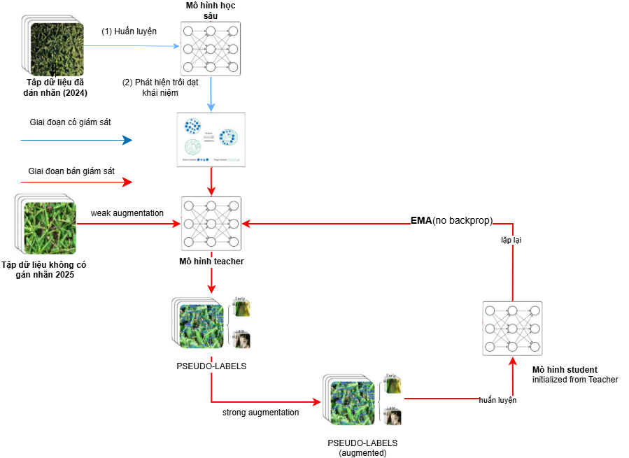

# Augmentation Matters Semi

## Scheme 2: EMA-based Semi-Supervised with Augmentation (general)



Trong nhánh này:
- `scheme_augmat_general/scripts/augmat_semi_general.sh` là script semi-supervised theo khung teacher-student.
- Teacher được cập nhật bằng EMA (Exponential Moving Average).
- Mỗi iteration sinh pseudo-label từ `Unlabeled_Images_2025`, sau đó train student trên tập trộn labeled + pseudo-labeled với strong augmentation.
- Script chạy 35 iterations với confidence warmup và dynamic pseudo-label sampling.
- Tỉ lệ ảnh pseudo-labeled tăng dần theo tiến trình: `2x -> 3x -> 4x` (theo kích thước tập labeled).

## Bảng kết quả

<table>
	<thead>
		<tr>
			<th>Bộ dữ liệu</th>
			<th>Ngưỡng tin cậy</th>
			<th>Trọng số mất mát</th>
			<th>Mô hình</th>
			<th>Độ chính xác</th>
			<th>Độ nhạy</th>
			<th>mAP0.5</th>
			<th>mAP0.5:0.95</th>
			<th>F1-score</th>
		</tr>
	</thead>
	<tbody>
		<tr>
			<td rowspan="9">2025 (chưa gán nhãn)</td>
			<td rowspan="9">Ngưỡng tin cậy động</td>
			<td rowspan="3">BCE</td>
			<td>YOLOv11</td>
			<td>57.7</td>
			<td>47.3</td>
			<td>50.9</td>
			<td>23.0</td>
			<td>52.0</td>
		</tr>
		<tr>
			<td>YOLOv11-SA</td>
			<td>58.7</td>
			<td>49.7</td>
			<td>52.5</td>
			<td>23.8</td>
			<td>53.8</td>
		</tr>
		<tr>
			<td>YOLOv11-SA custom</td>
			<td>55.7</td>
			<td>52.4</td>
			<td>53.1</td>
			<td>23.6</td>
			<td>54.0</td>
		</tr>
		<tr>
			<td rowspan="3">Varifocal</td>
			<td>YOLOv11</td>
			<td>52.8</td>
			<td>52.1</td>
			<td>47.8</td>
			<td>20.7</td>
			<td>52.4</td>
		</tr>
		<tr>
			<td>YOLOv11-SA</td>
			<td>54.3</td>
			<td>51.6</td>
			<td>48.3</td>
			<td>20.9</td>
			<td>52.9</td>
		</tr>
		<tr>
			<td>YOLOv11-SA custom</td>
			<td>54.2</td>
			<td>50.0</td>
			<td>46.5</td>
			<td>19.3</td>
			<td>52.0</td>
		</tr>
		<tr>
			<td rowspan="3">Varifocal Custom</td>
			<td>YOLOv11</td>
			<td>53.9</td>
			<td>51.3</td>
			<td>49.3</td>
			<td>21.4</td>
			<td>52.6</td>
		</tr>
		<tr>
			<td>YOLOv11-SA</td>
			<td>55.9</td>
			<td>50.5</td>
			<td>50.9</td>
			<td>22.7</td>
			<td>53.1</td>
		</tr>
		<tr>
			<td>YOLOv11-SA custom</td>
			<td>54.3</td>
			<td>51.2</td>
			<td>49.9</td>
			<td>21.6</td>
			<td>52.7</td>
		</tr>
	</tbody>
</table>

## Lệnh chạy

```bash
cd experiments/augmentation_matters_semi
bash scheme_augmat_general/scripts/augmat_semi_general.sh
```

Lưu ý:
- Script mặc định lấy checkpoint base từ `experiments/quoccuong_original/YOLOv11-All-Scheme-Flinta/YOLOv11-Base-400/weights/best.pt`.
- Cần chạy train gốc trước tại `experiments/quoccuong_original/scripts/original_train.sh` để có checkpoint khởi tạo.

