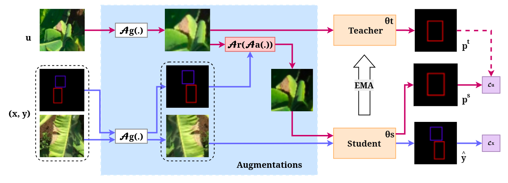

# YOLO_SEMI — AugSeg cho YOLO Detection

**Tham khảo:**
- AugSeg (CVPR 2023) — code gốc: <https://github.com/zhenzhao/AugSeg>
- Paper: *Augmentation Matters: A Simple-Yet-Effective Approach to Semi-Supervised Semantic Segmentation* — <https://openaccess.thecvf.com/content/CVPR2023/papers/Zhao_Augmentation_Matters_A_Simple-Yet-Effective_Approach_to_Semi-Supervised_Semantic_Segmentation_CVPR_2023_paper.pdf>



## 1. Huấn luyện

```bash
cd AugSeg_Remake/YOLO_SEMI
```

### 1.1. Train có giám sát (baseline)

```bash
python train_yolo_simple.py
```

### 1.2. Train bán giám sát (Teacher–Student với weak/strong augmentation)

Script `run.sh` nhận tham số `CONFIG GPUS PORT SEED`:

```bash
bash run.sh ../exps/conf_025/varifocal_custom/yolov11-sa-custom/config_semi.yaml 1 29500 42
```

**Trước khi chạy:** Sửa đường dẫn dataset và pretrain trong file config tương ứng.

## 2. Đánh giá

Sau khi train xong, thư mục snapshot (theo `saver.snapshot_dir` trong config) chứa:
- `best.pt`, `best_student.pt`, `last.pt` — định dạng Ultralytics, dùng trực tiếp với `yolo val`.
- `ckpt_best.pt`, `ckpt.pt` — checkpoint nội bộ, dùng để resume training.

### 2.1. Đánh giá bằng `yolo val`

```bash
yolo val \
    data=Banana_Disease_Dataset_Test.yaml \
    model=../exps/dynamic/varifocal_custom/yolov11/checkpoint/best.pt \
    imgsz=1024 \
    conf=0.1 \
    iou=0.1 \
    agnostic_nms=True \
    exist_ok=True
```

**Sửa đường dẫn theo model:**
- `data=...`: dataset yaml (chứa đường dẫn tập test)
- `model=...`: đường dẫn file `.pt` checkpoint cần đánh giá
- `imgsz`, `conf`, `iou`, ... → điều chỉnh tham số đánh giá nếu cần

## 3. Kết quả

Validation trên tập test (181 ảnh, 15052 instances, 2 classes). Giá trị **in đậm** = tăng so với baseline YOLOv11 cùng nhóm.

<table>
<thead>
<tr>
<th>Ngưỡng tin cậy</th>
<th>Trọng số mất mát</th>
<th>Mô hình</th>
<th>Độ chính xác</th>
<th>Độ nhạy</th>
<th>mAP0.5</th>
<th>mAP0.5:0.95</th>
<th>F1-score</th>
</tr>
</thead>
<tbody>
<tr>
<td rowspan="9">1%</td>
<td rowspan="3">BCE</td>
<td>YOLOv11</td>
<td>52.1</td><td>50.6</td><td>45.5</td><td>20.2</td><td>51.3</td>
</tr>
<tr><td>YOLOv11-SA</td><td>52.0</td><td>50.1</td><td>44.9</td><td>20.2</td><td>51.0</td></tr>
<tr><td>YOLOv11-SA custom</td><td><b>52.4</b></td><td><b>51.0</b></td><td><b>46.1</b></td><td>20.2</td><td><b>51.7</b></td></tr>
<tr>
<td rowspan="3">Varifocal</td>
<td>YOLOv11</td>
<td>52.5</td><td>47.8</td><td>47.3</td><td>21.5</td><td>50.0</td>
</tr>
<tr><td>YOLOv11-SA</td><td>51.5</td><td><b>48.0</b></td><td>45.2</td><td>19.9</td><td>49.7</td></tr>
<tr><td>YOLOv11-SA custom</td><td>49.7</td><td>44.6</td><td>43.1</td><td>19.0</td><td>47.0</td></tr>
<tr>
<td rowspan="3">Varifocal Custom</td>
<td>YOLOv11</td>
<td>53.1</td><td>46.4</td><td>46.9</td><td>21.2</td><td>49.5</td>
</tr>
<tr><td>YOLOv11-SA</td><td>51.4</td><td><b>48.0</b></td><td>45.1</td><td>19.9</td><td><b>49.6</b></td></tr>
<tr><td>YOLOv11-SA custom</td><td>49.2</td><td>44.5</td><td>42.9</td><td>19.0</td><td>46.7</td></tr>
<tr>
<td rowspan="9">25%</td>
<td rowspan="3">BCE</td>
<td>YOLOv11</td>
<td>56.9</td><td>54.8</td><td>54.7</td><td>24.4</td><td>55.8</td>
</tr>
<tr><td>YOLOv11-SA</td><td>56.5</td><td>52.8</td><td>53.0</td><td>23.7</td><td>54.6</td></tr>
<tr><td>YOLOv11-SA custom</td><td><b>58.3</b></td><td>51.7</td><td>53.1</td><td>23.1</td><td>54.8</td></tr>
<tr>
<td rowspan="3">Varifocal</td>
<td>YOLOv11</td>
<td>51.9</td><td>47.1</td><td>46.3</td><td>21.0</td><td>49.4</td>
</tr>
<tr><td>YOLOv11-SA</td><td>51.1</td><td><b>48.8</b></td><td><b>46.6</b></td><td><b>21.1</b></td><td><b>49.9</b></td></tr>
<tr><td>YOLOv11-SA custom</td><td>47.9</td><td><b>48.0</b></td><td>46.1</td><td>20.4</td><td>47.9</td></tr>
<tr>
<td rowspan="3">Varifocal Custom</td>
<td>YOLOv11</td>
<td>51.7</td><td>47.0</td><td>46.2</td><td>20.9</td><td>49.2</td>
</tr>
<tr><td>YOLOv11-SA</td><td>51.6</td><td><b>48.3</b></td><td><b>46.7</b></td><td><b>21.1</b></td><td><b>49.9</b></td></tr>
<tr><td>YOLOv11-SA custom</td><td>48.0</td><td><b>48.2</b></td><td>46.2</td><td>20.5</td><td>48.1</td></tr>
<tr>
<td rowspan="9">dynamic</td>
<td rowspan="3">BCE</td>
<td>YOLOv11</td>
<td>56.3</td><td>55.4</td><td>54.5</td><td>24.4</td><td>55.8</td>
</tr>
<tr><td>YOLOv11-SA</td><td><b>57.5</b></td><td>51.8</td><td>52.6</td><td>23.4</td><td>54.5</td></tr>
<tr><td>YOLOv11-SA custom</td><td><b>58.5</b></td><td>51.4</td><td>52.6</td><td>22.8</td><td>54.7</td></tr>
<tr>
<td rowspan="3">Varifocal</td>
<td>YOLOv11</td>
<td>51.8</td><td>47.0</td><td>46.3</td><td>21.0</td><td>49.3</td>
</tr>
<tr><td>YOLOv11-SA</td><td>51.2</td><td><b>48.7</b></td><td><b>46.8</b></td><td><b>21.1</b></td><td><b>49.9</b></td></tr>
<tr><td>YOLOv11-SA custom</td><td>48.0</td><td><b>48.1</b></td><td>46.2</td><td>20.5</td><td>48.0</td></tr>
<tr>
<td rowspan="3">Varifocal Custom</td>
<td>YOLOv11</td>
<td>51.8</td><td>46.9</td><td>46.1</td><td>21.0</td><td>49.2</td>
</tr>
<tr><td>YOLOv11-SA</td><td>51.2</td><td><b>48.7</b></td><td><b>46.7</b></td><td><b>21.1</b></td><td><b>49.9</b></td></tr>
<tr><td>YOLOv11-SA custom</td><td>48.0</td><td><b>48.1</b></td><td><b>46.2</b></td><td>20.5</td><td>48.0</td></tr>
</tbody>
</table>
