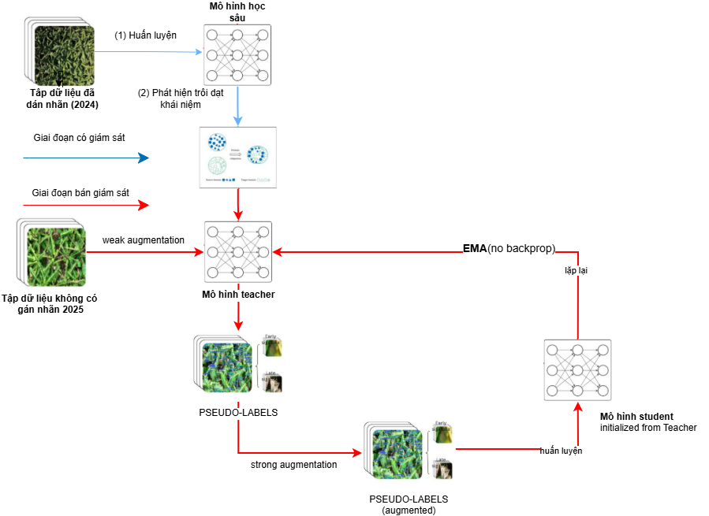

# Augmentation Matters Semi

## Scheme 2: EMA-based Semi-Supervised with Augmentation (general)



Trong nhánh này:
- `scheme_augmat_general/scripts/augmat_semi_general.sh` là script semi-supervised theo khung teacher-student.
- Teacher được cập nhật bằng EMA (Exponential Moving Average).
- Mỗi iteration sinh pseudo-label từ `Unlabeled_Images_2025`, sau đó train student trên tập trộn labeled + pseudo-labeled với strong augmentation.
- Script chạy 35 iterations với confidence warmup và dynamic pseudo-label sampling.
- Tỉ lệ ảnh pseudo-labeled tăng dần theo tiến trình: `2x -> 3x -> 4x` (theo kích thước tập labeled).

## Lệnh chạy

```bash
cd experiments/augmentation_matters_semi
bash scheme_augmat_general/scripts/augmat_semi_general.sh
```

Lưu ý:
- Script mặc định lấy checkpoint base từ `experiments/quoccuong_original/YOLOv11-All-Scheme-Flinta/YOLOv11-Base-400/weights/best.pt`.
- Cần chạy train gốc trước tại `experiments/quoccuong_original/scripts/original_train.sh` để có checkpoint khởi tạo.