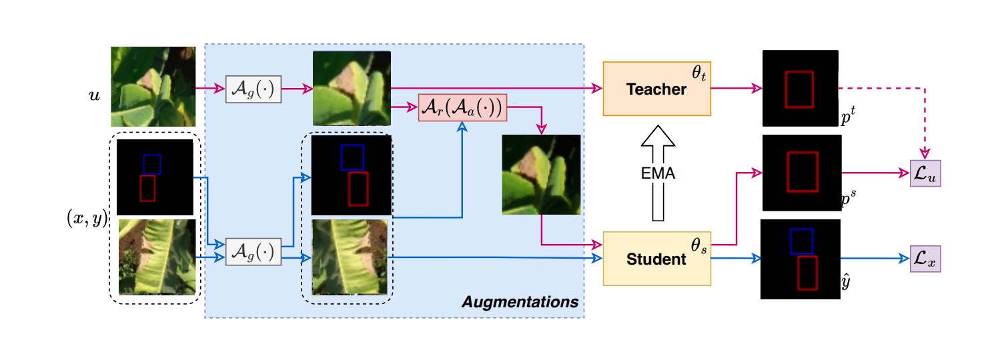

# Augmentation Matters Semi
# YOLO_SEMI

## Scheme 3



Trong nhánh này:
- `train_yolo_simple.py` là bước train gốc (baseline YOLO thường).
- `train_semi.py` (hoặc `run.sh`) là Scheme semi-supervised (iterative pseudo-labeling): teacher sinh pseudo-label cho ảnh unlabeled rồi train lặp theo epoch.

## Lệnh chạy

```bash
cd AugSeg_Remake/YOLO_SEMI
```

Train gốc:

```bash
python train_yolo_simple.py
```

Chạy Scheme semi-supervised:

```bash
bash run.sh exps/release/vfl_custom/yolov11-sa-custom/config_semi.yaml 1 29500 42
```

**Bước trước khi chạy - Sửa config:**

Mở file config (ví dụ `exps/release/vfl_custom/yolov11-sa-custom/config_semi.yaml`) và sửa:
1. Đường dẫn dữ liệu `train.data_root` và `train.data_list` → trỏ tới folder unlabeled
2. Đường dẫn validation `val.data_root` và `val.data_list` → trỏ tới tập đánh giá 2025
3. `unsupervised.threshold: 0.25` → điều chỉnh ngưỡng pseudo-label nếu cần

## Lệnh đánh giá

Sau khi train xong, lấy checkpoint tốt nhất từ folder `checkpoints/ckpt_best.pth`, rồi chạy 2 bước:

### Bước 1: Convert `.pth` sang `.pt`

```bash
python convert_pth_to_pt.py \
    --weights exps/release/vfl_custom/yolov11-sa-custom/checkpoints/ckpt_best.pth \
    --pretrain YOLO_SEMI/models/YOLOv11-SA-Custom-400/best.pt \
    --state-key teacher_state \
    --out exps/release/vfl_custom/yolov11-sa-custom/checkpoints/ckpt_best_teacher.pt
```

**Sửa đường dẫn theo model:**
- `--weights`: đường dẫn checkpoint `.pth` sau khi train
- `--pretrain`: đường dẫn file `.pt` pretrained dùng khi init model  
- `--out`: nơi lưu file `.pt` đã convert

### Bước 2: Đánh giá bằng `yolo val`

```bash
yolo val \
    data=Banana_Disease_Dataset_Test.yaml \
    model=exps/release/vfl_custom/yolov11-sa-custom/checkpoints/ckpt_best_teacher.pt \
    imgsz=1024 \
    conf=0.1 \
    iou=0.1 \
    agnostic_nms=True \
    exist_ok=True
```

**Sửa đường dẫn theo model:**
- `data=...`: dataset yaml (chứa đường dẫn tập 2025 unlabeled hoặc test)
- `model=...`: đường dẫn file `.pt` vừa convert ở bước 1
- `imgsz`, `conf`, `iou`, ... → điều chỉnh tham số đánh giá nếu cần

## Bảng kết quả


Ghi chú: trong code hiện tại, ngưỡng pseudo-label được đọc từ `trainer.unsupervised.threshold` và đang đặt `0.25`.

<table>
    <thead>
        <tr>
            <th>Trọng số mất mát</th>
            <th>Mô hình</th>
            <th>Độ chính xác</th>
            <th>Độ nhạy</th>
            <th>mAP0.5</th>
            <th>mAP0.5:0.95</th>
            <th>F1-score</th>
        </tr>
    </thead>
    <tbody>
        <tr>
            <td rowspan="3">BCE</td>
            <td>YOLOv11</td>
            <td>66.0</td>
            <td>36.8</td>
            <td>50.1</td>
            <td>24.2</td>
            <td>47.3</td>
        </tr>
        <tr>
            <td>YOLOv11-SA</td>
            <td>58.0</td>
            <td>50.3</td>
            <td>51.4</td>
            <td>21.9</td>
            <td>53.9</td>
        </tr>
        <tr>
            <td>YOLOv11-SA custom</td>
            <td>58.5</td>
            <td>50.9</td>
            <td>52.9</td>
            <td>24.0</td>
            <td>54.4</td>
        </tr>
        <tr>
            <td rowspan="3">Varifocal</td>
            <td>YOLOv11</td>
            <td>39.2</td>
            <td>42.8</td>
            <td>35.9</td>
            <td>15.9</td>
            <td>40.9</td>
        </tr>
        <tr>
            <td>YOLOv11-SA</td>
            <td>44.8</td>
            <td>40.7</td>
            <td>37.7</td>
            <td>16.9</td>
            <td>42.7</td>
        </tr>
        <tr>
            <td>YOLOv11-SA custom</td>
            <td>47.7</td>
            <td>45.1</td>
            <td>42.7</td>
            <td>19.3</td>
            <td>46.4</td>
        </tr>
        <tr>
            <td rowspan="3">Varifocal Custom</td>
            <td>YOLOv11</td>
            <td>41.3</td>
            <td>40.7</td>
            <td>36.1</td>
            <td>15.6</td>
            <td>41.0</td>
        </tr>
        <tr>
            <td>YOLOv11-SA</td>
            <td>41.5</td>
            <td>42.1</td>
            <td>35.9</td>
            <td>15.6</td>
            <td>41.8</td>
        </tr>
        <tr>
            <td>YOLOv11-SA custom</td>
            <td>46.8</td>
            <td>43.9</td>
            <td>40.1</td>
            <td>17.7</td>
            <td>45.3</td>
        </tr>
    </tbody>
</table>
