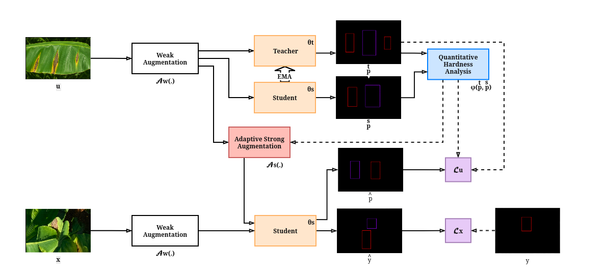

# iMAS_Remake — iMAS cho YOLO Detection

Bản remake của iMAS (Instance-specific and Model-adaptive Supervision) áp dụng cho semi-supervised YOLO object detection trên dataset banana.

**Tham khảo:**
- iMAS (CVPR 2023, paper): *Instance-specific and Model-adaptive Supervision for Semi-supervised Semantic Segmentation* — <https://arxiv.org/abs/2211.11335>
- iMAS (code gốc): <https://github.com/zhenzhao/iMAS>



## 1. Tổng quan

Pipeline teacher–student với EMA, áp dụng iMAS cho detection qua:
- hardness evaluation
- adaptive augmentation
- adaptive CutMix

Code chính:
- `train_yolo_sup.py`, `train_yolo_semi.py`, `eval_yolo.py`
- `imas/` (Ultralytics bridge)
- `exps/yolo_det/` (config YOLO)

Các thư mục `exps/voc_*`, `exps/citys_*`, `exps/city_sups`, `train_semi.py`, `train_sup.py` là phần segmentation gốc, giữ lại để tham khảo.

## 2. Huấn luyện

### 2.1. Train có giám sát (baseline)

```bash
bash single_run_yolo_sup.sh
```

Tương đương:

```bash
python train_yolo_sup.py --config ./exps/yolo_det/config_sup.yaml --seed 2
```

Có thể đổi config qua biến môi trường: `CONFIG=./exps/yolo_det/config_sup.yaml SEED=42 bash single_run_yolo_sup.sh`.

### 2.2. Train bán giám sát (iMAS)

```bash
bash single_run_yolo_semi.sh
```

Tương đương:

```bash
python train_yolo_semi.py --config ./exps/yolo_det/config_semi.yaml --seed 2
```

### 2.3. Trước khi chạy — cấu hình cần sửa

Mở `exps/yolo_det/config_semi.yaml` hoặc `config_sup.yaml` và sửa:
- `data.root` / các file dataset để trỏ tới `banana_data`.
- `student.init_pt`, `teacher.pt` để trỏ tới pretrained weights.
- `project.output_root` để trỏ tới nơi lưu checkpoint/log.

Các tham số train/semi-supervised khác có thể điều chỉnh khi cần.

## 3. Đánh giá

### 3.1. Vị trí checkpoint

Sau khi train xong, trong `${project.output_root}/online/` sẽ có:
- `best.pt`, `last.pt` — định dạng Ultralytics, dùng trực tiếp với `yolo val` / `YOLO('best.pt')`.
- `ckpt_best.pt`, `ckpt.pt` — checkpoint nội bộ, dùng resume training.

### 3.2. Đánh giá bằng `yolo val`

```bash
yolo val \
    data=./data/banana_data/meta/dataset_supervised.yaml \
    model=./release/SA-Origin/varifocal_custom/dynamic_conf/online/best.pt \
    imgsz=1024 \
    conf=0.1 \
    iou=0.1 \
    agnostic_nms=True \
    exist_ok=True
```

## 4. Kết quả

Đánh giá trên bộ dữ liệu **2025 (chưa gán nhãn)** với 3 cấu hình ngưỡng tin cậy pseudo-label: `1%`, `25%`, và `dynamic`.

<table>
<thead>
<tr>
<th>Ngưỡng tin cậy</th>
<th>Trọng số mất mát</th>
<th>Mô hình</th>
<th>Độ chính xác</th>
<th>Độ nhạy</th>
<th>mAP0.5</th>
<th>mAP0.5:0.95</th>
<th>F1-score</th>
</tr>
</thead>
<tbody>
<tr>
<td rowspan="9">1%</td>
<td rowspan="3">BCE</td>
<td>YOLOv11</td>
<td>56.8</td><td>50.8</td><td>51.5</td><td>22.5</td><td>53.6</td>
</tr>
<tr><td>YOLOv11-SA</td><td>54.2</td><td>49.7</td><td>47.0</td><td>20.6</td><td>51.9</td></tr>
<tr><td>YOLOv11-SA custom</td><td><b>54.3</b></td><td><b>51.1</b></td><td><b>48.8</b></td><td><b>21.5</b></td><td><b>52.7</b></td></tr>
<tr>
<td rowspan="3">Varifocal</td>
<td>YOLOv11</td>
<td><b>53.4</b></td><td>49.7</td><td>49.0</td><td>22.1</td><td>51.5</td>
</tr>
<tr><td>YOLOv11-SA</td><td><b>54.7</b></td><td>49.3</td><td>48.8</td><td>22.1</td><td><b>51.9</b></td></tr>
<tr><td>YOLOv11-SA custom</td><td>48.6</td><td><b>47.9</b></td><td><b>44.9</b></td><td><b>19.8</b></td><td>48.2</td></tr>
<tr>
<td rowspan="3">Varifocal Custom</td>
<td>YOLOv11</td>
<td>53.5</td><td>49.9</td><td>49.2</td><td><b>22.1</b></td><td>51.6</td>
</tr>
<tr><td>YOLOv11-SA</td><td>54.2</td><td>47.3</td><td>47.7</td><td>21.5</td><td>50.5</td></tr>
<tr><td>YOLOv11-SA custom</td><td><b>48.6</b></td><td><b>47.7</b></td><td><b>45.6</b></td><td>20.1</td><td><b>48.1</b></td></tr>
<tr>
<td rowspan="9">25%</td>
<td rowspan="3">BCE</td>
<td>YOLOv11</td>
<td>54.8</td><td>48.7</td><td>48.0</td><td>21.2</td><td>51.6</td>
</tr>
<tr><td>YOLOv11-SA</td><td>44.0</td><td>47.9</td><td>36.5</td><td>15.5</td><td>45.9</td></tr>
<tr><td>YOLOv11-SA custom</td><td><b>38.7</b></td><td><b>46.8</b></td><td><b>31.7</b></td><td><b>13.6</b></td><td><b>42.4</b></td></tr>
<tr>
<td rowspan="3">Varifocal</td>
<td>YOLOv11</td>
<td><b>48.5</b></td><td>48.0</td><td>42.7</td><td>18.4</td><td>48.2</td>
</tr>
<tr><td>YOLOv11-SA</td><td><b>46.2</b></td><td>46.9</td><td>41.1</td><td>18.1</td><td><b>46.5</b></td></tr>
<tr><td>YOLOv11-SA custom</td><td>44.6</td><td><b>47.8</b></td><td><b>40.3</b></td><td><b>17.4</b></td><td>46.1</td></tr>
<tr>
<td rowspan="3">Varifocal Custom</td>
<td>YOLOv11</td>
<td>48.3</td><td>47.5</td><td>42.9</td><td><b>18.7</b></td><td>47.9</td>
</tr>
<tr><td>YOLOv11-SA</td><td>45.4</td><td>47.2</td><td>40.4</td><td>17.5</td><td>46.3</td></tr>
<tr><td>YOLOv11-SA custom</td><td><b>47.6</b></td><td><b>43.5</b></td><td><b>40.2</b></td><td>17.2</td><td><b>45.5</b></td></tr>
<tr>
<td rowspan="9">dynamic</td>
<td rowspan="3">BCE</td>
<td>YOLOv11</td>
<td>59.4</td><td>49.9</td><td>51.8</td><td>24.3</td><td>54.2</td>
</tr>
<tr><td>YOLOv11-SA</td><td>50.2</td><td>47.0</td><td>42.4</td><td>18.5</td><td>48.5</td></tr>
<tr><td>YOLOv11-SA custom</td><td><b>57.5</b></td><td><b>51.8</b></td><td><b>52.6</b></td><td><b>23.5</b></td><td><b>54.5</b></td></tr>
<tr>
<td rowspan="3">Varifocal</td>
<td>YOLOv11</td>
<td><b>47.8</b></td><td>48.0</td><td>43.2</td><td>19.1</td><td>47.9</td>
</tr>
<tr><td>YOLOv11-SA</td><td><b>46.1</b></td><td>47.4</td><td>41.6</td><td>18.1</td><td><b>46.7</b></td></tr>
<tr><td>YOLOv11-SA custom</td><td>44.7</td><td><b>47.1</b></td><td><b>40.3</b></td><td><b>17.5</b></td><td>45.9</td></tr>
<tr>
<td rowspan="3">Varifocal Custom</td>
<td>YOLOv11</td>
<td>43.9</td><td>47.0</td><td>39.7</td><td><b>17.6</b></td><td>45.4</td>
</tr>
<tr><td>YOLOv11-SA</td><td>47.2</td><td>45.8</td><td>40.8</td><td>17.5</td><td>46.5</td></tr>
<tr><td>YOLOv11-SA custom</td><td><b>45.1</b></td><td><b>46.8</b></td><td><b>40.7</b></td><td>17.8</td><td><b>45.9</b></td></tr>
</tbody>
</table>