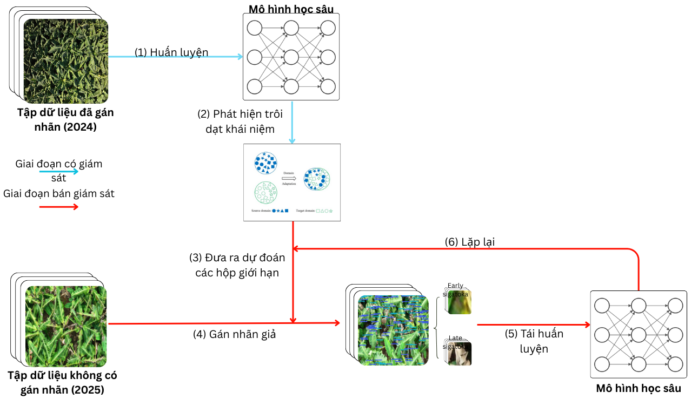

# Quoc Cuong Original

## Scheme 1: Iterative Pseudo-Labeling (Original)



Trong nhánh này:
- `original_train.sh` là bước train gốc (khởi tạo model ban đầu).
- `original_semi_supervised.sh` mới là Scheme semi-supervised (iterative pseudo-labeling): sinh pseudo-label cho `Unlabeled_Images_2025` rồi train lặp theo iteration.

## Lệnh chạy

```bash
cd experiments/quoccuong_original
```

Train gốc:

```bash
bash scripts/original_train.sh
```

Chạy Scheme semi-supervised:

```bash
bash scripts/original_semi_supervised.sh
```

## Lệnh đánh giá

Từ thư mục `experiments/quoccuong_original`, chạy:

### Đánh giá tập 2024 (đã gán nhãn)

```bash
# YOLOv11-Base
yolo val \
	data=configs/Banana_Disease_Dataset_Test.yaml \
	model=YOLOv11-All-Scheme-Flinta/YOLOv11-Base-400/weights/best.pt \
	imgsz=1024 \
	exist_ok=True \
	conf=0.1 \
	iou=0.1 \
	agnostic_nms=True

# YOLOv11-SA-Origin
yolo val \
	data=configs/Banana_Disease_Dataset_Test.yaml \
	model=YOLOv11-All-Scheme-Flinta/YOLOv11-SA-Origin-400/weights/best.pt \
	imgsz=1024 \
	exist_ok=True \
	conf=0.1 \
	iou=0.1 \
	agnostic_nms=True

# YOLOv11-SA-Custom
yolo val \
	data=configs/Banana_Disease_Dataset_Test.yaml \
	model=YOLOv11-All-Scheme-Flinta/YOLOv11-SA-Custom-400/weights/best.pt \
	imgsz=1024 \
	exist_ok=True \
	conf=0.1 \
	iou=0.1 \
	agnostic_nms=True
```

## Bảng kết quả

### Bộ dữ liệu 2024 (đã gán nhãn)

<table>
	<thead>
		<tr>
			<th>Trọng số mất mát</th>
			<th>Mô hình</th>
			<th>Độ chính xác</th>
			<th>Độ nhạy</th>
			<th>mAP0.5</th>
			<th>mAP0.5:0.95</th>
			<th>F1-score</th>
		</tr>
	</thead>
	<tbody>
		<tr>
			<td rowspan="3">-</td>
			<td>YOLOv11</td>
			<td>79.4</td>
			<td>74.6</td>
			<td>81.1</td>
			<td>54.1</td>
			<td>76.9</td>
		</tr>
		<tr>
			<td>YOLOv11-SA</td>
			<td>79.3</td>
			<td>74.7</td>
			<td>81.6</td>
			<td>54.7</td>
			<td>76.9</td>
		</tr>
		<tr>
			<td>YOLOv11-SA custom</td>
			<td>78.8</td>
			<td>75.6</td>
			<td>81.5</td>
			<td>54.4</td>
			<td>77.2</td>
		</tr>
	</tbody>
</table>

### Đánh giá tập 2025 (chạy theo từng iter, chọn kết quả tốt nhất)

```bash
# Trong configs/Banana_Disease_Dataset_Test.yaml:
# - Bỏ comment dòng 2025:
#   val: banana_dataset/Banana_Dataset_ValTest_2025/test_each1
# - Comment lại dòng 2024:
#   val: banana_dataset/Banana_Dataset_2024_TrainValTest/test/

# Chạy val tương tự ở trên và thay từng model vào hoặc chạy nhanh như này:
for prefix in YOLOv11-Base-400 YOLOv11-SA-Origin-400 YOLOv11-SA-Custom-400
do
	for ckpt in \
		YOLOv11-All-Scheme-Flinta/${prefix}/weights/best.pt \
		YOLOv11-All-Scheme-Flinta/${prefix}-Iter*/weights/best.pt \
		YOLOv11-All-Scheme-Flinta/${prefix}-Conf001-Iter*/weights/best.pt
	do
		[ -f "$ckpt" ] || continue
		run_name=$(basename "$(dirname "$(dirname "$ckpt")")")
		yolo val data=configs/Banana_Disease_Dataset_Test.yaml model="$ckpt" imgsz=1024 exist_ok=True conf=0.1 iou=0.1 agnostic_nms=True project="YOLOv11-Val-2025-${prefix}" name="$run_name"
	done
done

```

Sau khi val ra kết quả, tự chọn run có mAP50-95 cao nhất

### Bộ dữ liệu 2025 (chưa gán nhãn) - Ngưỡng tin cậy 1%

<table>
	<thead>
		<tr>
			<th>Trọng số mất mát</th>
			<th>Mô hình</th>
			<th>Độ chính xác</th>
			<th>Độ nhạy</th>
			<th>mAP0.5</th>
			<th>mAP0.5:0.95</th>
			<th>F1-score</th>
		</tr>
	</thead>
	<tbody>
		<tr>
			<td rowspan="3">BCE</td>
			<td>YOLOv11</td>
			<td>45.2</td>
			<td>38.6</td>
			<td>39.9</td>
			<td>17.2</td>
			<td>41.6</td>
		</tr>
		<tr>
			<td>YOLOv11-SA</td>
			<td>46.5</td>
			<td>37.5</td>
			<td>40.2</td>
			<td>17.4</td>
			<td>41.5</td>
		</tr>
		<tr>
			<td>YOLOv11-SA custom</td>
			<td>47.9</td>
			<td>38.9</td>
			<td>41.5</td>
			<td>18.3</td>
			<td>42.9</td>
		</tr>
		<tr>
			<td rowspan="3">Varifocal</td>
			<td>YOLOv11</td>
			<td>48.1</td>
			<td>39.7</td>
			<td>35.8</td>
			<td>14.1</td>
			<td>43.5</td>
		</tr>
		<tr>
			<td>YOLOv11-SA</td>
			<td>48.1</td>
			<td>41.7</td>
			<td>36.9</td>
			<td>14.5</td>
			<td>44.7</td>
		</tr>
		<tr>
			<td>YOLOv11-SA custom</td>
			<td>45.7</td>
			<td>42.6</td>
			<td>38.2</td>
			<td>15.1</td>
			<td>44.1</td>
		</tr>
		<tr>
			<td rowspan="3">Varifocal Custom</td>
			<td>YOLOv11</td>
			<td>48.8</td>
			<td>40.7</td>
			<td>39.7</td>
			<td>16.4</td>
			<td>44.4</td>
		</tr>
		<tr>
			<td>YOLOv11-SA</td>
			<td>47.3</td>
			<td>41.4</td>
			<td>39.4</td>
			<td>16.3</td>
			<td>44.2</td>
		</tr>
		<tr>
			<td>YOLOv11-SA custom</td>
			<td>49.7</td>
			<td>42.9</td>
			<td>40.5</td>
			<td>16.1</td>
			<td>46.1</td>
		</tr>
	</tbody>
</table>

### Bộ dữ liệu 2025 (chưa gán nhãn) - Ngưỡng tin cậy 25%

<table>
	<thead>
		<tr>
			<th>Trọng số mất mát</th>
			<th>Mô hình</th>
			<th>Độ chính xác</th>
			<th>Độ nhạy</th>
			<th>mAP0.5</th>
			<th>mAP0.5:0.95</th>
			<th>F1-score</th>
		</tr>
	</thead>
	<tbody>
		<tr>
			<td rowspan="3">BCE</td>
			<td>YOLOv11</td>
			<td>72.7</td>
			<td>11.0</td>
			<td>41.0</td>
			<td>21.7</td>
			<td>19.1</td>
		</tr>
		<tr>
			<td>YOLOv11-SA</td>
			<td>73.1</td>
			<td>16.4</td>
			<td>44.1</td>
			<td>22.3</td>
			<td>26.8</td>
		</tr>
		<tr>
			<td>YOLOv11-SA custom</td>
			<td>71.9</td>
			<td>14.4</td>
			<td>42.3</td>
			<td>21.2</td>
			<td>24.0</td>
		</tr>
		<tr>
			<td rowspan="3">Varifocal</td>
			<td>YOLOv11</td>
			<td>49.9</td>
			<td>41.9</td>
			<td>41.9</td>
			<td>19.0</td>
			<td>45.6</td>
		</tr>
		<tr>
			<td>YOLOv11-SA</td>
			<td>46.2</td>
			<td>42.1</td>
			<td>40.4</td>
			<td>18.2</td>
			<td>44.1</td>
		</tr>
		<tr>
			<td>YOLOv11-SA custom</td>
			<td>51.2</td>
			<td>44.3</td>
			<td>44.2</td>
			<td>19.5</td>
			<td>47.5</td>
		</tr>
		<tr>
			<td rowspan="3">Varifocal Custom</td>
			<td>YOLOv11</td>
			<td>50.7</td>
			<td>44.1</td>
			<td>45.0</td>
			<td>20.6</td>
			<td>47.2</td>
		</tr>
		<tr>
			<td>YOLOv11-SA</td>
			<td>48.9</td>
			<td>45.5</td>
			<td>45.3</td>
			<td>20.3</td>
			<td>47.1</td>
		</tr>
		<tr>
			<td>YOLOv11-SA custom</td>
			<td>50.7</td>
			<td>45.7</td>
			<td>46.4</td>
			<td>21.2</td>
			<td>48.1</td>
		</tr>
	</tbody>
</table>

### Bộ dữ liệu 2025 (chưa gán nhãn) - Ngưỡng tin cậy dynamic (25% → 20%)

<table>
	<thead>
		<tr>
			<th>Trọng số mất mát</th>
			<th>Mô hình</th>
			<th>Độ chính xác</th>
			<th>Độ nhạy</th>
			<th>mAP0.5</th>
			<th>mAP0.5:0.95</th>
			<th>F1-score</th>
		</tr>
	</thead>
	<tbody>
		<tr>
			<td rowspan="3">BCE</td>
			<td>YOLOv11</td>
			<td>73.1</td>
			<td>13.9</td>
			<td>42.5</td>
			<td>21.3</td>
			<td>23.4</td>
		</tr>
		<tr>
			<td>YOLOv11-SA</td>
			<td>74.4</td>
			<td>11.7</td>
			<td>42.3</td>
			<td>22.2</td>
			<td>20.2</td>
		</tr>
		<tr>
			<td>YOLOv11-SA custom</td>
			<td>53.5</td>
			<td>43.2</td>
			<td>44.7</td>
			<td>19.8</td>
			<td>47.8</td>
		</tr>
		<tr>
			<td rowspan="3">Varifocal</td>
			<td>YOLOv11</td>
			<td>51.3</td>
			<td>43.4</td>
			<td>43.8</td>
			<td>19.8</td>
			<td>47.0</td>
		</tr>
		<tr>
			<td>YOLOv11-SA</td>
			<td>56.6</td>
			<td>25.4</td>
			<td>39.2</td>
			<td>18.0</td>
			<td>35.1</td>
		</tr>
		<tr>
			<td>YOLOv11-SA custom</td>
			<td>55.0</td>
			<td>42.9</td>
			<td>45.8</td>
			<td>20.8</td>
			<td>48.2</td>
		</tr>
		<tr>
			<td rowspan="3">Varifocal Custom</td>
			<td>YOLOv11</td>
			<td>51.7</td>
			<td>41.5</td>
			<td>42.5</td>
			<td>18.5</td>
			<td>46.0</td>
		</tr>
		<tr>
			<td>YOLOv11-SA</td>
			<td>49.5</td>
			<td>44.4</td>
			<td>42.1</td>
			<td>18.5</td>
			<td>46.8</td>
		</tr>
		<tr>
			<td>YOLOv11-SA custom</td>
			<td>52.6</td>
			<td>42.7</td>
			<td>44.5</td>
			<td>19.7</td>
			<td>47.2</td>
		</tr>
	</tbody>
</table>


